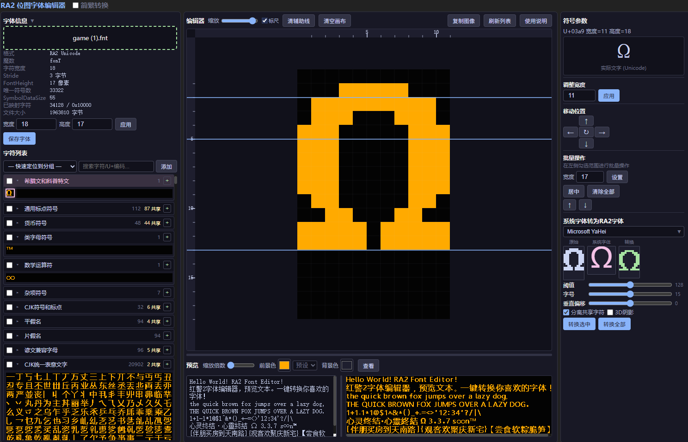
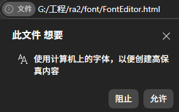
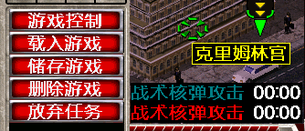
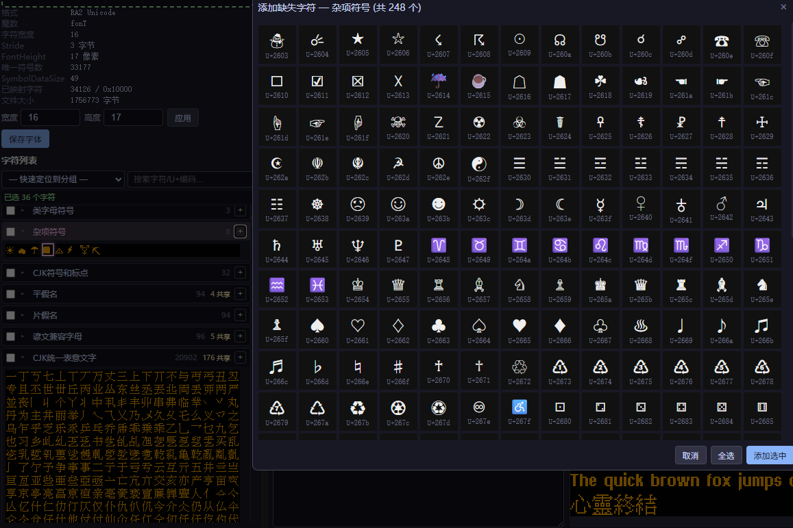
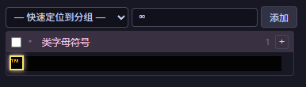
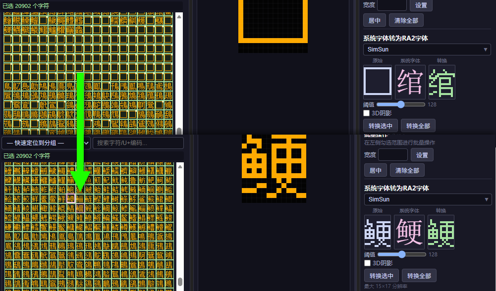
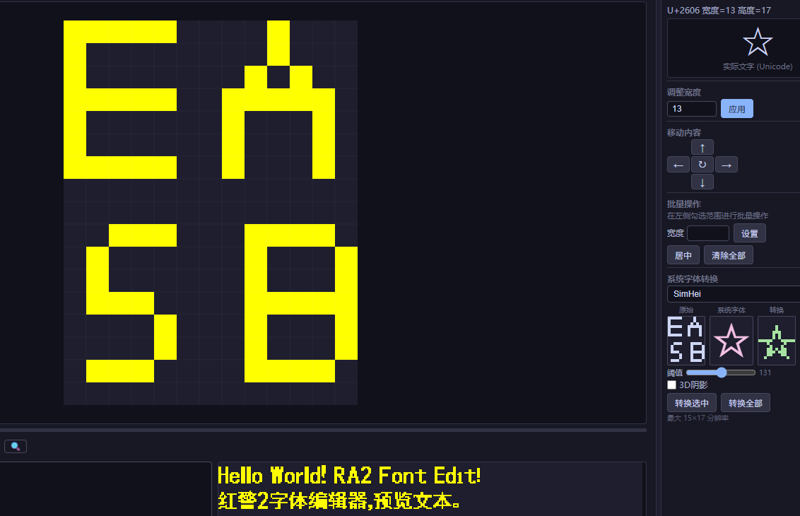
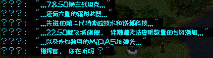
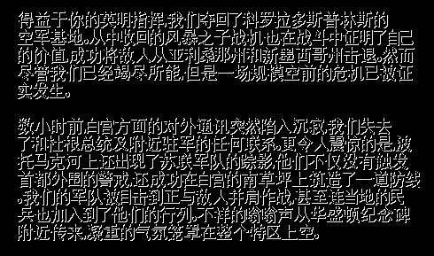
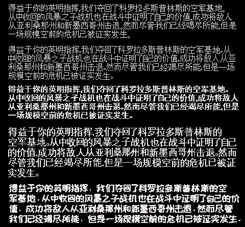

## RA2字体编辑器

Red Alert 2 font editor.

## 主要功能

将系统字体或加载的字体转为ra2格式字体,使用当前字符范围。
缺失的字符直接选中即可添加。
手动编辑任意符号，并有辅助线便于定位。
可以快速定位字符位置。
批量调整符号宽度和居中，可用于制作等宽字体。
批量位置编辑，以及拼接不同字体。
分离共用数据的占位字符。
预览字体。
简繁转换。

## 使用

双击打开 `FontEditor.html` 即可。
在左上角加载游戏字体，即 `game.fnt` 。
在右边栏选择系统字体或拖放字体。  
|               |
| ------------------------------------------ |
| `允许以获取系统字体列表，否则使用内置列表` |

你可以一键转换全部字符为指定字体。
如果你想修改部分字符为指定字体，需要在左侧选中字符。

- 你可以勾选复选框或shift/ctrl+鼠标框选进行批量选择
- 你可以批量设置宽度或居中，这可用于制作等宽字体
- 你可以在左侧搜索，可以通过简繁转换输入简体搜索对应繁体

如果你想修改字符宽度需要在右侧符号参数中修改。
相关文档中说每个字符限制256个像素，即16x16或15x17,因此不建议修改字体整体的宽高。

但实际上看起来可以适量超过，比如17x17，20x20，字符过大时会有闪烁或显示不完整现象，我不知道更大的代价是什么。

- 受字体不同实现等原因，你可以选比15大一点的字体，但宽度仍然在15内。
- 这是20x20的黑体：
  

由于一次性加载数万字符，因此卡一下是正常的。
在大量生成字符时，卡的久一点也是正常的。
卡多久与电脑配置有关，耐心等待几秒到几十秒。

## 功能展示

添加字符

添加不存在符号,搜不到情况下可以添加黑图,稍后生成。

分离共用字符,自动补充缺失字符，你也可以关闭"分离字符"选项保持缺失状态。

编辑字符，字符是自动保存的，为避免卡顿，编辑后不会立刻在刷新其它地方显示。
手动编辑不参与分离字符选项，可修改缺省字符。

### 字体转换能力展示

正常字效果不明显,所以放点离谱的

图一乐的3D效果

## 格式和编辑实现参考:

[Westwood BitFont Format](https://moddingwiki.shikadi.net/wiki/Westwood_BitFont_Format)
[Nyerguds/WWFontEditor](https://github.com/Nyerguds/WWFontEditor)
